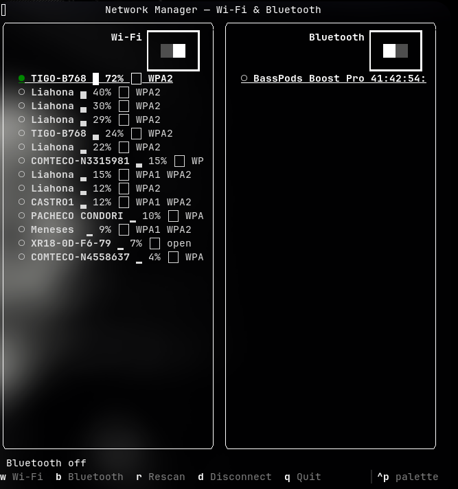

# link-tui

A lightweight, modern **TUI** for managing **Wi-Fi** and **Bluetooth** connections from the terminal, built with [Textual](https://textual.textualize.io/). Inspired by the quick control panels of mobile devices and tailored for **Arch Linux** (and tiling window managers) with *NetworkManager* and *BlueZ*.



## Features

- ⚡ Toggle **Wi-Fi** / **Bluetooth** on and off
- 📡 Scan and list available Wi-Fi networks (active first, with signal bars)
- 🔒 Connect to open or protected (WPA/WPA2) networks via a password modal
- 🎧 Pair, connect and disconnect Bluetooth devices, showing battery level
- 🖥️ Fully **transparent** background (shows your terminal's transparency)
- ⌨️ Keyboard-driven, tiling-WM friendly (i3, Hyprland, Sway)

## Dependencies

- Python 3.10+ and `python-textual` (`pip install textual`)
- `networkmanager` (provides `nmcli`)
- `bluez` and `bluez-utils` (provide `bluetoothctl`)

## Installation

### From source (pip)

```bash
git clone https://github.com/jorgeTTPD/link-tui
cd link-tui
pip install -e .
```

### From the built wheel

```bash
cd link-tui
python -m build --wheel
pip install dist/link_tui-*.whl
```

### Arch Linux (PKGBUILD)

The repository includes a [PKGBUILD](PKGBUILD) ready for `makepkg`:

```bash
cd link-tui
python -m build --sdist          # generates dist/link_tui-0.1.0.tar.gz
cp dist/link_tui-0.1.0.tar.gz .  # place the tarball next to the PKGBUILD
makepkg -si                      # build and install with pacman
```

## Usage

```bash
link-tui
```

Or without installing:

```bash
PYTHONPATH=src python3 -m link_tui
```

## Key bindings

| Key | Action |
|-----|--------|
| `w` | Toggle Wi-Fi on/off |
| `b` | Toggle Bluetooth on/off |
| `r` | Rescan networks and devices |
| `Tab` | Switch column (Wi-Fi / Bluetooth) |
| `↑` / `↓` | Navigate the lists |
| `Enter` | Connect selected network/device |
| `d` | Disconnect the selected item |
| `q` / `Esc` | Quit |

Protected networks (WPA/WPA2) open a modal to capture the password.

## Testing

```bash
PYTHONPATH=src python3 -m unittest discover -s tests
```

## License

[MIT](LICENSE)
